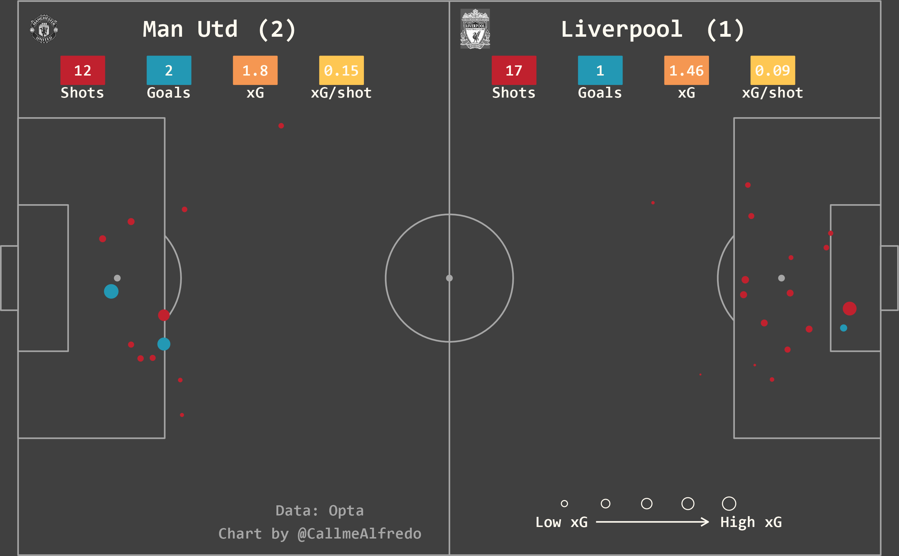
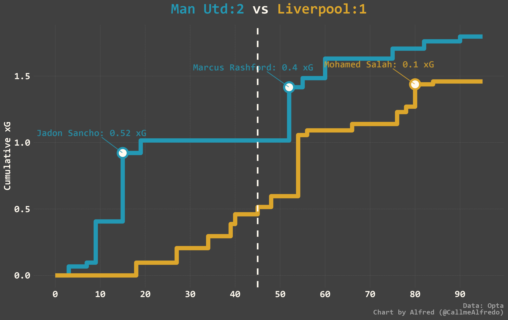
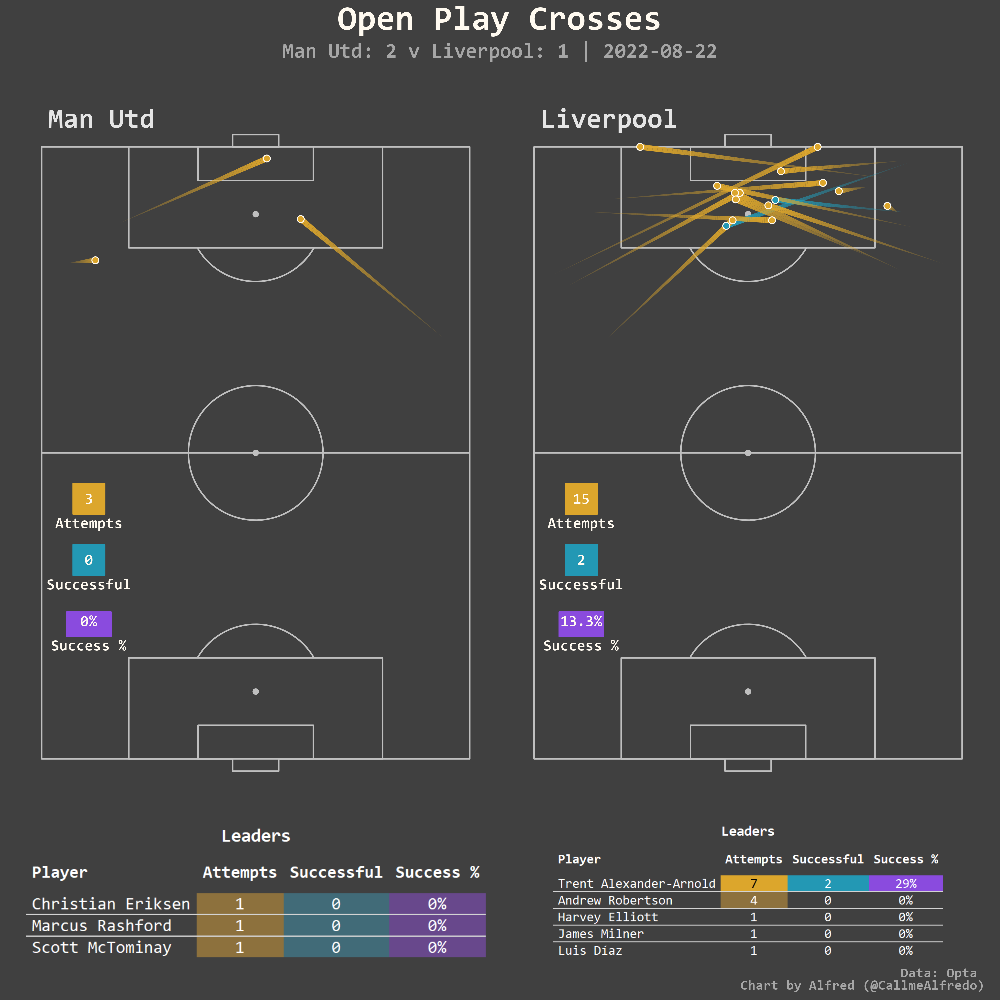

# football_data_viz
Repo for sharing post game visualizations on twitter. After some selected games in the premier league, I post visualizations to highlight performances in the game. Some of those visualizations are show below 
## xG shotmap

## xG timelines

## Game summary statistics

## Team passing network

## Passing into the final third

## Open play cross map

## Switches of play

## Expected threat created by players

More visualization available [here](https://github.com/aappiah17/football_data_viz/tree/main/Charts/LFC)
